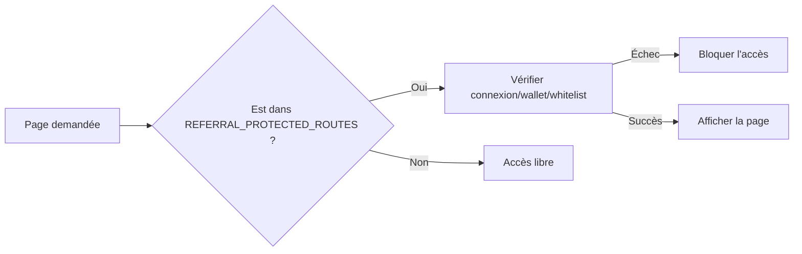

# Guide de la Page de Gestion des Referrals

## ⚙️ Intégration technique
> Pour une vue d’ensemble du flux d’onboarding et de l’usage des codes côté utilisateur final, consultez également `./REFERRAL_GUIDE.md`.
Les vérifications de whitelist sont désormais **centralisées** via `src/lib/referralRoutesConfig.ts`.

### Pour modifier les règles d'accès
1. Éditez `src/lib/referralRoutesConfig.ts` pour ajouter/supprimer des routes.
2. Aucune modification n'est nécessaire dans `src/app/referral-management/page.tsx` (la logique est automatiquement appliquée).

### Schéma de fonctionnement

## Fichiers impliqués
- `src/app/referral-management/page.tsx`
- `src/lib/referralRoutesConfig.ts`
- `src/lib/abi/ReferralRegistry.json`
- `src/lib/referralUtils.ts`

## Rappels
- Cette configuration n'affecte pas la page `/referral` (point d'entrée pour obtenir la whitelist).
- Utilisez `MB-[20rem]` pour les espacements verticaux lorsque pertinent.

## Liens utiles
- Connexion wallet et réseau: `./WALLET_CONNECTION_GUIDE.md`
- Implémentation des vaults: `./contracts/STRATEGY_1_VaultContract.md`

## Détails fonctionnels

### Vue d'ensemble

La page de gestion des referrals (`/referral-management`) permet aux utilisateurs qui ont un parrain de créer et gérer leurs propres codes de parrainage.

### Fonctionnalités

#### 1. Protection d'accès
- Vérification obligatoire : Seuls les utilisateurs ayant un parrain peuvent accéder à cette page
- Vérification réseau : L'utilisateur doit être connecté au réseau HyperEVM Testnet
- Vérification wallet : L'utilisateur doit avoir un wallet connecté

#### 2. Affichage des données
- Codes créés : Nombre total de codes créés par l'utilisateur
- Codes disponibles : Nombre de codes non utilisés et non expirés
- Quota maximum : Limite de codes autorisés (5 par défaut)
- Informations parrain : Adresse du parrain de l'utilisateur

#### 3. Fonctionnalités d'interaction
- Création de codes : Génération de nouveaux codes de parrainage
- Copie de codes : Copie des codes dans le presse-papiers
- Suppression de codes : Suppression de codes (réservé aux admins)

### Structure technique

#### Fichiers impliqués
- `src/app/referral-management/page.tsx` - Page principale
- `src/components/layout/Header.tsx` - Navigation ajoutée
- `src/lib/abi/ReferralRegistry.json` - ABI du contrat
- `src/lib/referralUtils.ts` - Utilitaires

#### Fonctions du contrat utilisées
- `referrerOf(address)` - Vérifier si l'utilisateur a un parrain
- `codesCreated(address)` - Nombre de codes créés
- `getUnusedCodes(address)` - Codes disponibles
- `createCode()` - Créer un nouveau code
- `revokeCode(bytes32)` - Supprimer un code (admin only)

#### Hooks Wagmi utilisés
- `useAccount()` - Informations du wallet
- `useChainId()` - Vérification du réseau
- `useContractRead()` - Lecture des données du contrat
- `useContractWrite()` - Écriture sur le contrat
- `useWaitForTransactionReceipt()` - Attente des confirmations

### Interface utilisateur

#### Sections principales
1. Hero - Titre et description
2. Statistiques - Métriques clés (3 cartes)
3. Informations parrain - Détails du parrain
4. Création de code - Bouton pour générer un nouveau code
5. Liste des codes - Codes disponibles avec actions

#### États d'interface
- Chargement - Pendant les vérifications
- Accès refusé - Si l'utilisateur n'a pas de parrain
- Réseau incorrect - Si pas sur HyperEVM Testnet
- Non connecté - Si pas de wallet connecté

### Sécurité

#### Vérifications côté client
- Vérification de la connexion wallet
- Vérification du réseau (HyperEVM Testnet uniquement)
- Vérification de l'existence d'un parrain
- Gestion des erreurs de transaction

#### Limitations
- La suppression de codes nécessite les droits d'admin
- Les codes expirent après 30 jours (environ 216,000 blocs)
- Quota limité à 5 codes par utilisateur
- **NOUVEAU** : Utilisation de `block.number` pour les expirations (résistance à la manipulation temporelle)

### Navigation

#### Accès
- URL directe : `/referral-management`
- Header : Bouton "Gestion" ajouté
- Redirection : Depuis la page referral si déjà parrainé

#### Redirections
- Pas de parrain → Page `/referral` pour utiliser un code
- Réseau incorrect → Message d'erreur avec instructions
- Pas connecté → Demande de connexion wallet

### Styles et design

#### Classes Tailwind utilisées
- `bg-gradient-to-b from-gray-900 to-black` - Fond principal
- `hero-gradient` - Section hero
- `glass-card` - Cartes en verre
- `bg-gradient-to-r from-purple-600 to-blue-500` - Boutons CTA

#### Composants réutilisés
- `Header` - Navigation principale
- `Footer` - Pied de page
- `GlassCard` - Cartes en verre
- `Stat` - Affichage des statistiques
- `Button` - Boutons d'action

### Tests et validation

#### Points à vérifier
1. Accès refusé pour utilisateurs sans parrain
2. Affichage correct des statistiques
3. Création de codes fonctionnelle
4. Copie des codes dans le presse-papiers
5. Gestion des erreurs de transaction
6. Responsive design

#### Cas d'usage
- Nouvel utilisateur : Doit d'abord utiliser un code de parrainage
- Utilisateur parrainé : Peut créer et gérer ses codes
- Admin : Peut supprimer des codes (fonctionnalité limitée)

### Développement futur

#### Améliorations possibles
- [ ] Ajout de notifications push pour les nouveaux filleuls
- [ ] Historique des codes utilisés
- [ ] Statistiques détaillées des parrainages
- [ ] Système de récompenses
- [ ] Export des données de parrainage

#### Optimisations
- [ ] Mise en cache des données du contrat
- [ ] Optimisation des requêtes blockchain
- [ ] Amélioration de l'UX mobile
- [ ] Ajout d'animations supplémentaires
